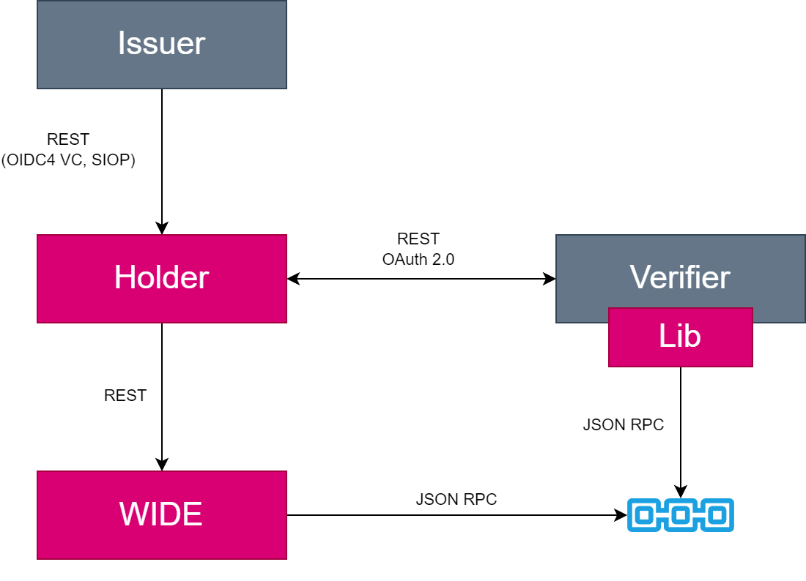
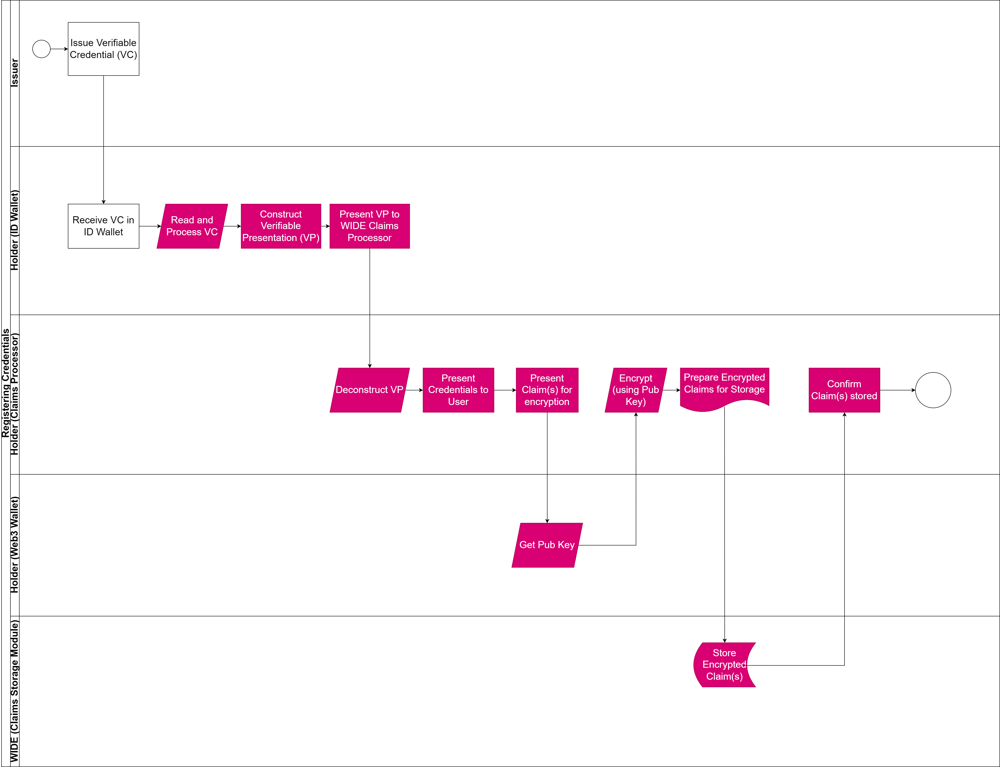
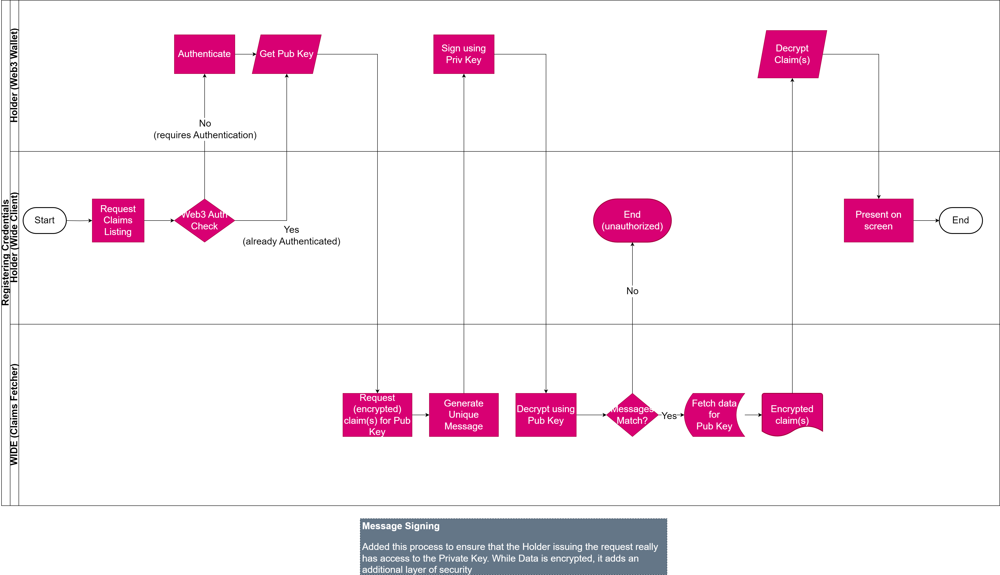
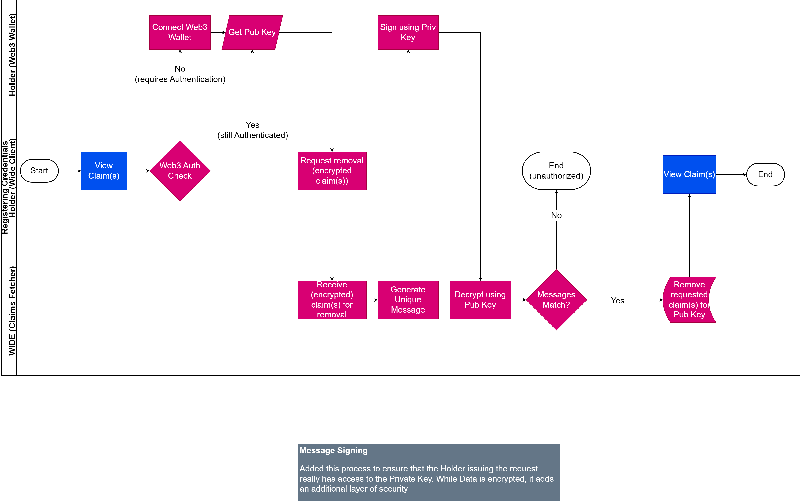
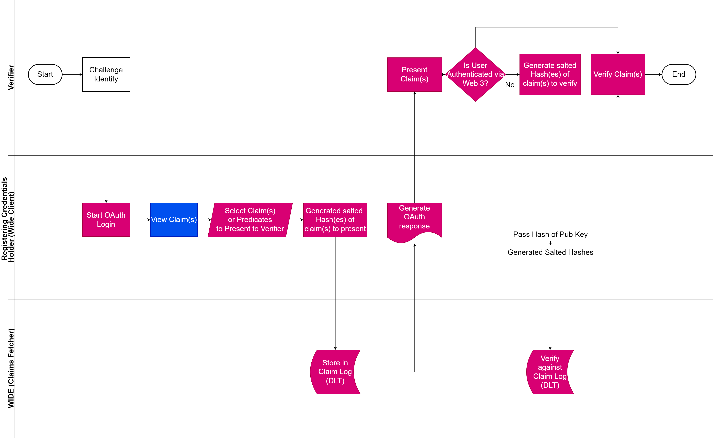

# WIDE Core Library

**WIDE** is short for Web3 Identity for DAOs and Education. The project was incepted in response to the 2023 #OC1 by the NGI TRUSTCHAIN consortium. **WIDE** is being developed and maintained by a consortium led by acurraent UG, coordinated by Joshua Ellul, Director of the Centre for Distributed Ledger Technologies at the University of Malta, and the technical lead Matthew Scerri .

*WIDE addresses the challenges of market fragmentation and low interoperability for decentralised identity management. WIDE seeks uses decentralised ledger technology (DLT) for secure claim verification and encryption to integrate decentralised identity functionalities with decentralised autonomous organizations (DAOs), along with introducing authorization interfaces that may be more familiar to users of legacy systems. The architecture of WIDE is modular, designed to interact within distinct operational contexts: Issuers, Holders, and Verifiers. WIDE is being developed as an open-source project under the EUPL-1.2 License, emphasising our commitment to transparency and collaborative development.*

## A Decentralised Identity Bridge

WIDE operates at the intersection of edge and cloud wallets to tackle the remaining and more challenging innovations within the decentralised identity paradigm. WIDE takes the opportunity to not only build decentralised identity bridges, but also connect governmental identity spheres with the emergent Web3 landscape.

WIDE is a direct response to the high market fragmentation and low interoperability, which originates from the identification of discrepancies between the state of the art in decentralised identity and the ARF. Thus, WIDE does not formally have a background that consists of artefacts or software code. In essence, WIDE fills the interoperability gap between eIDAS 2.0 and Web3 by developing a bridging service.

Holders, i.e. end-users, currently have to manage a number of different authentication mechanisms used by Verifiers to allow for their credentials to be verified. WIDE proposes a solution to the fragmentation of Holder claims being spread across multiple sources and multiple standards by bridging the gap between the different models. It provides the Holder with the ability to capture and store claims securely from different identity providers remotely, while linking such claims to their Web3 wallet. Furthermore, WIDE aims to provide Verifiers with the option to interact with the Holder via either OAuth or Web3 to ensure future-proofing.

## Concept

## General Architecture
The General Architecture shows the overall design of the WIDE, specifically focusing on the different components and the interaction between them.

### Flows
The flows provide an overview of the process through which a user may store, view, present and remove claims.

#### Store Claims

#### View Claims

#### Remove Claims

#### Present Claims

## Disclaimer

This research and development project is part of the **[NGI TRUSTCHAIN #OC1](https://trustchain.ngi.eu/wide/)**. All software code is provided as is and without warranty under permissible EUPL 1.2 licencing. This project is funded by a cascade funding partner through a Horizon Europe Grant under the TrustChain grant with grant agreement number: [101093274](https://doi.org/10.3030/101093274).

