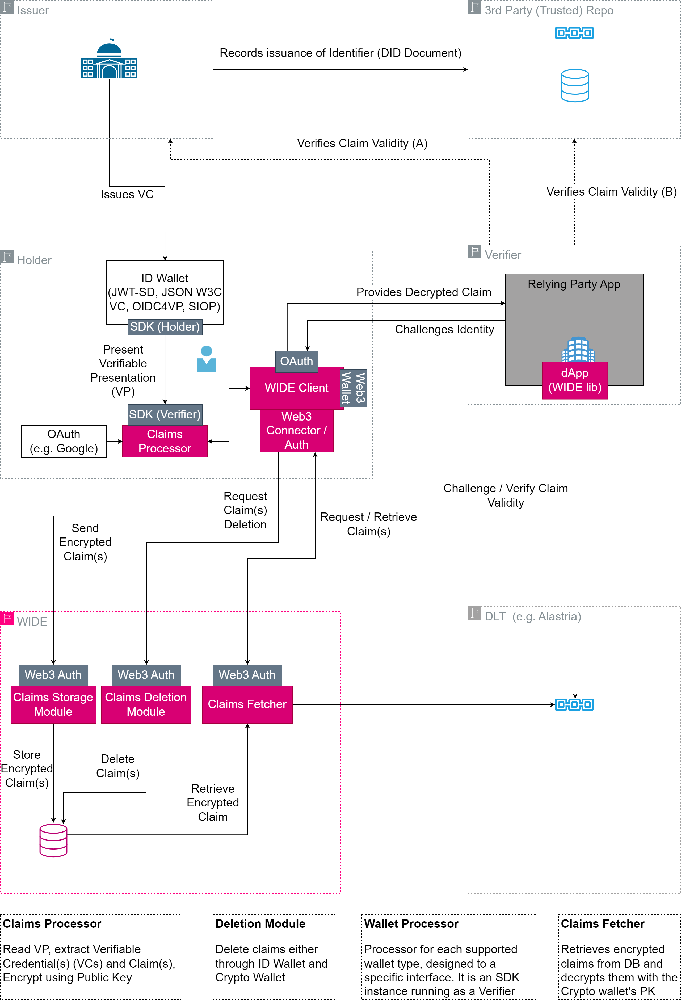
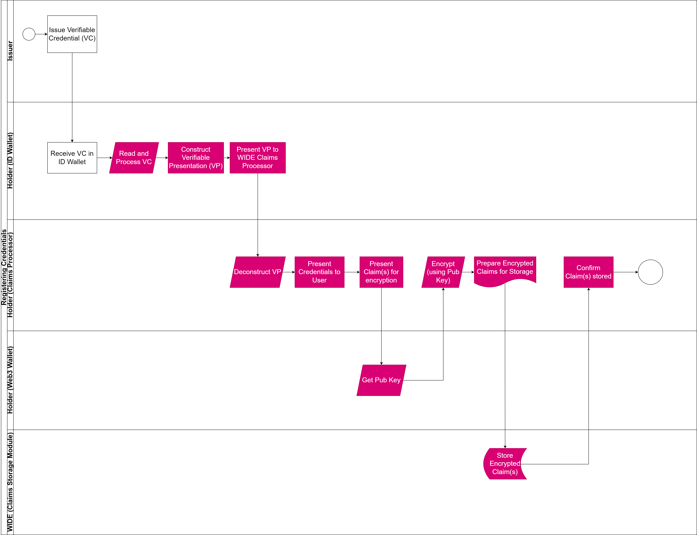
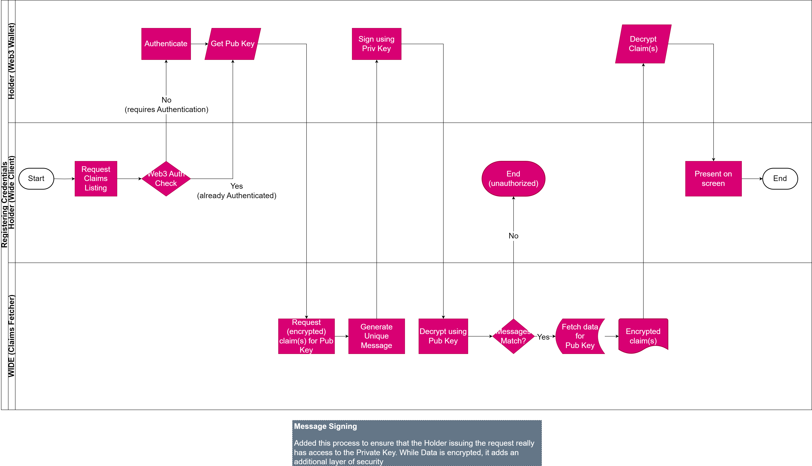
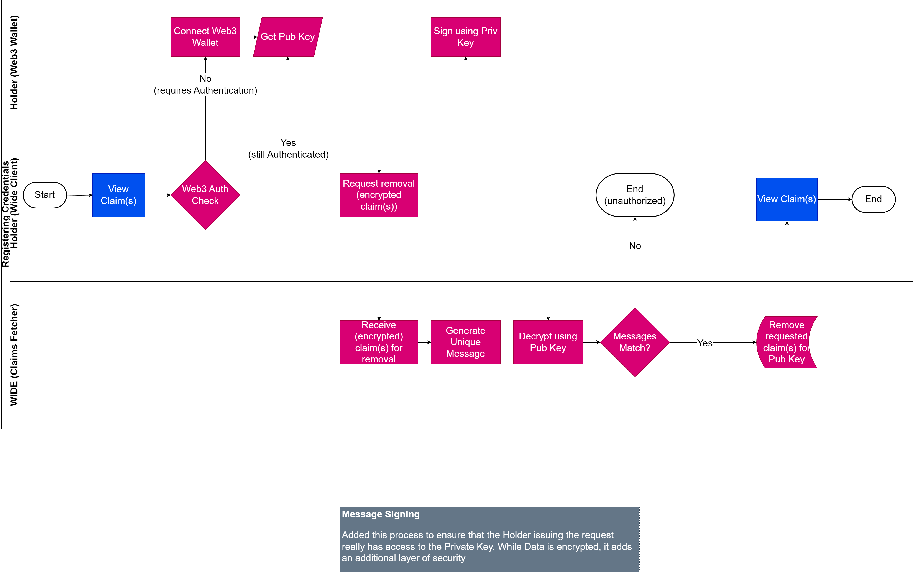
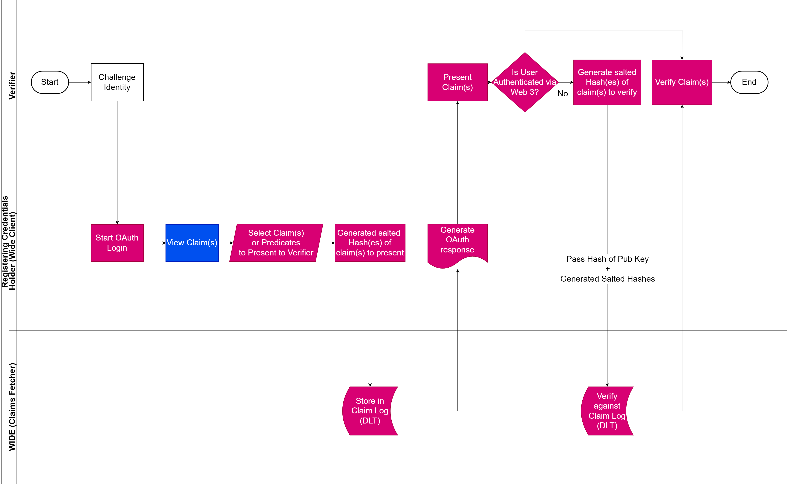

# Architecture
This document collates the architecture documentation for WIDE.

# General Architecture
The General Architecture shows the overall design of the WIDE, specifically focusing on the different components and the interaction between them.

## Flows
The flows provide an overview of the process through which a user may store, view, present and remove claims.

### Store Claims

### View Claims

### Remove Claims

### Present Claims
